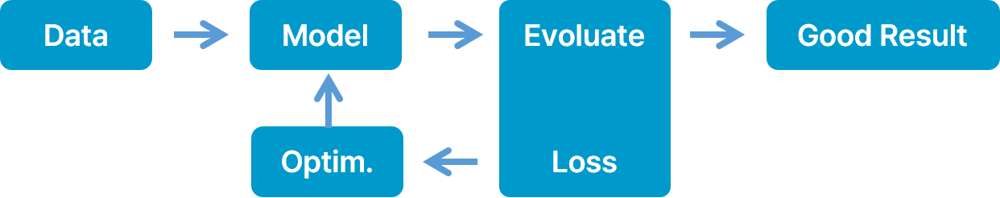

# 📚 인공지능 기초

 

 

## 1. 인공지능이란?

인간 같은 인지력을 구현하는것을 목표로 하고 있음

추론, 문제해결, 계획, 이해, 학습, 그리고 패턴을 인식

기계의 지능을 다루는 컴퓨터 분야

 

#### 최초의 인공지능

퍼셉트론

XOR문제는 풀수 없다 -> 인공지능의 겨울

 

#### 첫번째 재탄생

컨볼루션 기반의 뉴럴넷 LeNet-5

 

#### 두번째 재탄생

Convolutional Neural Networks의 재탄생

 

#### 기계학습 패러다임의 변화

> 과거
>
> Machine Learning
>
> 입력 -> (사람)특징 추출 -> 분류 -> 출력

> 현재
>
> Deep Learning
>
> 입력 -> 특징 추출&분류 -> 출력

 

#### 지각 능력이 중요한 이유

- 지각능력 : (입력, 출력) 데이터

인간은 자라며 상호작용을 하며 배움

인간처럼 multi-modal 의 상호관계성으로부터 유용한 정보 수집

 

#### 강화 학습

현상 관찰 -> 계획 수립 -> 의사결정 -> 보상 -> 계획 수립 & 현상 관찰

 

## 2. 기계가 학습을 는 일반적인 방법

`관찰` -> `이해` -> `평가` -> `적용`

관찰 : 현상 관찰, 상황 파악

이해 : 경험, 지식 기반으로 상황을 패턴화

평가 : 기준에 의한 평가 기준 - 사람 또는 시스템 (게임)

적용 : 최적 모델 응용

 
