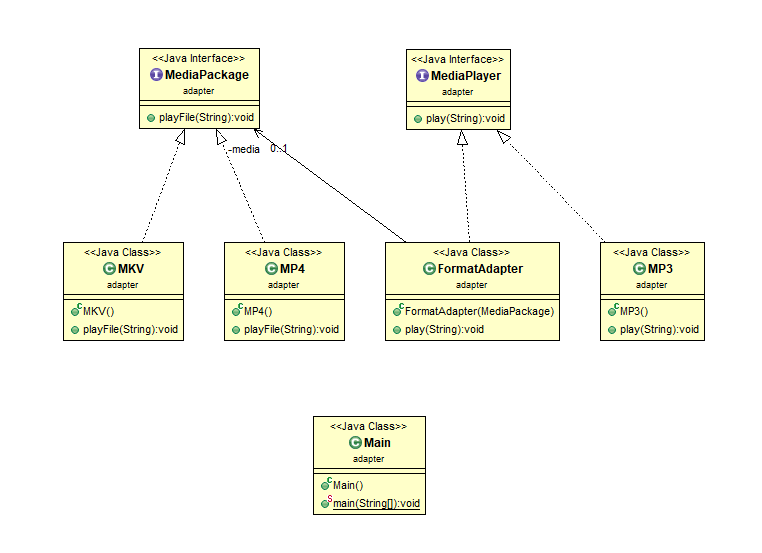

# 📚 Adapter Pattern, 어댑터 패턴

<br>

<br>

## 어댑터 패턴이란?

> - 용도 : 클래스를 바로 사용할 수 없는 경우가 있음 (다른 곳에서 개발했다거나, 수정할 수 없을 때)
>   중간에서 변환 역할을 해주는 클래스가 필요 → 어댑터 패턴
>
> - 사용 방법 : 상속
> - 호환되지 않은 인터페이스를 사용하는 클라이언트 그대로 활용 가능
>
> - 향후 인터페이스가 바뀌더라도, 변경 내역은 어댑터에 캡슐화 되므로 클라이언트는 바뀔 필요X

어댑터 패턴은 이름대로 어댑터처럼 사용되는 패턴

220V 를 사용하는 한국에서 쓰던 기기들을, 어댑터를 사용하면 110V 를 쓰는곳에 가서도 그대로 쓸 수 있음

이처럼 호환성이 없는 인터페이스 때문에 함께 동작할 수 없는 클래스들이 함께 작동하도록 해주는 패턴이 어댑터 패턴

이를 위해 어댑터 역할을 하는 클래스를 새로 만들어야 함

기존에 있는 시스템에 새로운 써드파티 라이브러리가 추가된다던지, 레거시 인터페이스를 새로운 인터페이스로 교체하는 경우에 코드의 재사용성을 높일 수 있는 방법이 어댑터 패턴을 사용하는 것

<br>

아이폰의 이어폰을 생각해보면

가장 흔한 이어폰 잭을 아이폰에 사용하려면, 잭 자체가 맞지 않음

따라서 우리는 어댑터를 따로 구매해서 연결해야 이런 이어폰들을 사용할 수 있음

이처럼 **어댑터는 필요로 하는 인터페이스로 바꿔주는 역할**을 함


이처럼 업체에서 제공한 클래스가 기존 시스템에 맞지 않으면?

> 기존 시스템을 수정할 것이 아니라, 어댑터를 활용해 유연하게 해결 가능

<br>

## 코드로 이해하기



MediaPackage를 MediaPlayer에서 사용할 수 있게 도와주는 FormatAdapter Class

<br>

- MediaPlayer.java

```java
public interface MediaPlayer{
   void play(String filename);
}
```

- MP3.java

```java
public class MP3 implements MediaPlayer{
   @Override
   void play(String filename){
      System.out.println("Playing MP3 File ♪ : "filename);
   }
}
```

- MediaPackage.java

```java
public interface MediaPackage{
   void play(String filename);
}
```

- MP4.java

```java
public class MP4 implements MediaPlayer{
   @Override
   void play(String filename){
      System.out.println("Playing MP4 File ▶ : "filename);
   }
}
```

- MKV.java

```java
public class MKV implements MediaPlayer{
   @Override
   void play(String filename){
      System.out.println("Playing MKV File ▶ : "filename);
   }
}
```

- FormatAdapter.java

```java
public class FormatAdapter implements MediaPlayer{

   private MediaPackage media;

   public FormatAdapter(MediaPackage video){
      this.media = video;
   }

   @Override
   void play(String filename){
      System.out.println("Using Adapter : ");
      media.playFile(filename);
   }

}
```

- Main.java

```java
public class Main{

   public static void main(String[] args){

   MediaPlayer mp3Player = new MP3();
   mp3Player.play("file.mp3");

   mp3Player = new FormatAdapter(new MP4());
   mp3Player.play("file.mp4");

   mp3Player = new FormatAdapter(new MKV());
   mp3Player.play("file.mkv");

   }

}
```
