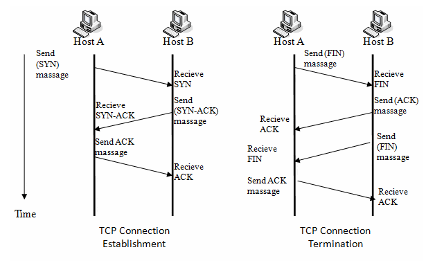

# 📚 TCP 3 way handshake & 4 way handshake

 

 

### 1. TCP handshaking

> 연결을 성립하고 해제하는 과정

3-Way handshake는 TCP의 연결을 초기화 할때, 4-Way handshake는 세션을 종료하기 위해 사용됨

 

### 2. 연결 성립- 3 way handshake

TCP는 정확한 전송을 보장해야 함

따라서 통신하기에 앞서, 논리적인 접속을 성립하기 위해 3 way handshake 과정을 진행

1. 클라이언트가 서버에게 SYN 패킷을 보냄 (sequence : x)

2. 서버가 SYN(x)을 받고, 클라이언트로 받았다는 신호인 ACK와 SYN 패킷을 보냄 (sequence : y, ACK : x + 1)

3. 클라이언트는 서버의 응답은 ACK(x+1)와 SYN(y) 패킷을 받고, ACK(y+1)를 서버로 보냄

 

이렇게 3번의 통신이 완료되면 연결이 성립

 

 

### 3. 연결 해제 - 4 way handshake

연결 성립 후, 모든 통신이 끝났다면 해제해야 함

1. 클라이언트는 서버에게 연결을 종료한다는 FIN 플래그를 보냄

2. 서버는 FIN을 받고, 확인했다는 ACK를 클라이언트에게 보냄 (이때 모든 데이터를 보내기 위해 CLOSE_WAIT 상태)

3. 데이터를 모두 보냈다면, 연결이 종료되었다는 FIN 플래그를 클라이언트에게 보냄

4. 클라이언트는 FIN을 받고, 확인했다는 ACK를 서버에게 보냄 (아직 서버로부터 받지 못한 데이터가 있을 수 있으므로 TIME_WAIT을 통해 대기)

- 서버는 ACK를 받은 이후 소켓을 닫음 (Closed)

- TIME_WAIT 시간이 끝나면 클라이언트도 닫음 (Closed)

 

이렇게 4번의 통신이 완료되면 연결이 해제됨

 
