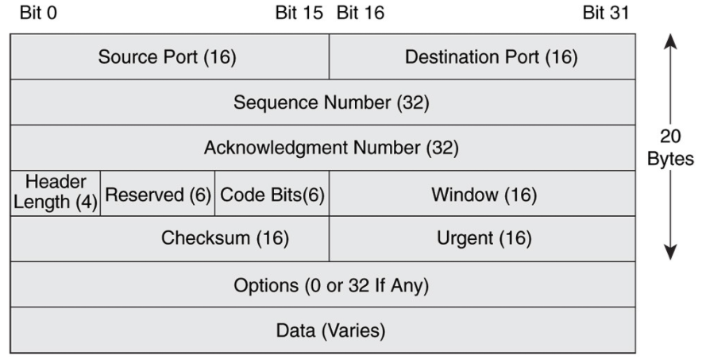
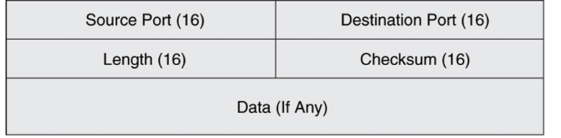

# 📚 TCP & UDP

 

 

네트워크 계층중 전송 계층은 데이터의 전달을 담당

데이터를 보내기 위해 사용되는 프로토콜에 TCP와 UDP가 있음

 

## 1. TCP (Transmission Control Protocol)

> 인터넷상에서 데이터를 메세지의 형태로 보내기 위해 IP와 함께 사용하는 프로토콜

일반적으로 TCP와 IP를 함께 사용하는데, IP가 데이터의 배달을 처리한다면 TCP는 패킷을 추적 및 관리

TCP는 연결형 서비스를 지원하는 프로토콜로 인터넷 환경에서 기본으로 사용

 

#### TCP 특징

- 연결형 서비스로 가상 회선 방식을 제공

- 3-way handshaking과정을 통해 연결을 설정하고 4-way handshaking을 통해 해제

- 흐름 제어 및 혼잡 제어

- 높은 신뢰성을 보장

- UDP보다 속도가 느림

- 전이중(Full-Duplex), 점대점(Point to Point) 방식

TCP는 연결형 서비스로 신뢰성을 보장 (그래서 3-way handshaking의 과정도 사용, 데이터의 흐름제어나 혼잡 제어와 같은 기능)

하지만 이러한 기능때문에 UDP보다 속도가 느림

TCP는 연속성보다 신뢰성 있는 전송이중요할 때에 사용하는 프로토콜 (파일 전송 등)

 

#### TCP 서버 특징

- 서버소켓은 연결만을 담당

- 연결과정에서 반환된 클라이언트 소켓은 데이터의 송수신에 사용된다형 서비스로 가상 회선 방식을 제공

- 서버와 클라이언트는 1대1로 연결

- 스트림 전송으로 전송 데이터의 크기가 무제한

- 패킷에 대한 응답을 해야하기 때문에(시간 지연, CPU 소모) 성능이 낮음

- 손실된 경우 재전송 요청을 하므로 Streaming 서비스에 불리

 

`패킷`

인터넷 내에서 데이터를 보내기 위한 경로배정(라우팅)을 효율적으로 하기 위해서 데이터를 여러 개의 조각들로 나누어 전송을 하는데 이때, 이 조각을 패킷이라 함

`TCP의 패킷 추적/관리 방법`

데이터는 패킷단위로 나누어 같은 목적지(IP계층)으로 전송. 패킷에 번호를 부여하여 목적지에서 재조립. 번호를 통해 분실 확인 등의 패킷을 추적하며, 나눠진 데이터를 받고 조립 가능

 

#### TCP Header

TCP 헤더의 최소 크기 : 20byte

- 플래그 : 약속된 신호를 남기기 위한 용도로 프로그램에서 사용되는 미리 정의된 비트

> URG : 긴급포인터
>
> ACK : 응답 메세지
>
> PSH : 데이터를 포함
>
> RST : 수신 거부
>
> SYN : 연결 요청 메세지
>
> FIN : 종료

- 윈도우 사이즈 : 전송할 데이터의 최대 크기

- 체크섬 : 데이터의 변조를 확인하기 위한 값. 보낸 값과 받은 값을 비교

 

## 2. UDP (User Datagram Protocol)

> 데이터를 데이터그램 단위로 처리하는 프로토콜

데이터 그램이란 독립적인 관계를 지니는 패킷이라는 뜻

TCP와 달리 비연결형 프로토콜

연결을 위해 할당되는 논리적인 경로가 없어 각 패킷은 다른 경로로 전송되고, 독립적인 관계를 지님

데이터를 서로 다른 경로로 독립적으로 처리하는 프로토콜을 UDP라 함

 

#### UDP 특징

- 비연결형 서비스로 데이터그램 방식을 제공

- 정보를 주고 받을 때 정보를 보내거나 받는다는 신호절차를 거치지 않음

- UDP헤더의 CheckSum 필드를 통해 최소한의 오류만 검출

- 신뢰성이 낮음

- TCP보다 속도가 빠름

UDP는 비연결형 서비스이기 때문에, 연결을 설정하고 해제하는 과정이 존재하지 않음

서로 다른 경로로 독립적으로 처리함에도 패킷에 순서를 부여하여 재조립을 하거나 흐름 제어 또는 혼잡 제어와 같은 기능도 처리하지 않기에 TCP보다 속도가 빠르며 네트워크 부하가 적다는 장점이 있지만 신뢰성있는 데이터의 전송을 보장하지는 못함

신뢰성보다는 연속성이 중요한 서비스 (실시간 서비스(streaming))에 자주 사용됨

 

#### UDP 서버의 특징

- UDP에는 연결 자체가 없어서(connect 함수 불필요) 서버 소켓과 클라이언트 소켓의 구분이 없음

- 소켓 대신 IP를 기반으로 데이터를 전송

- 서버와 클라이언트는 1대1, 1대N, N대M 등으로 연결 가능

- 데이터그램(메세지) 단위로 전송되며 그 크기는 65535바이트로, 크기가 초과하면 잘라서 보냄

- 흐름제어(flow control)가 없어서 패킷이 제대로 전송되었는지, 오류가 없는지 확인 불가능

- 파일 전송과 같은 신뢰성이 필요한 서비스보다 성능이 중요시 되는 경우에 사용됨

 

#### UDP Header

UDP 헤더의 고정 크기 : 8byte

 

## 3. TCP와 UDP

1. IP의 역할은 Host to Host (장치 to 장치)만을 지원. 장치에서 장치로 이동은 IP로 해결되지만, 하나의 장비안에서 수많은 프로그램들이 통신을 할 경우에는 IP만으로는 한계가 존재.

2. 또한, IP에서 오류가 발생한다면 ICMP에서 알려주나 ICMP는 알려주기만 할 뿐 대처를 못하기 때문에 IP보다 위에서 처리를 해줘야 함

- 1번을 해결하기 위하여 포트 번호가 나오게 됐고, 2번을 해결하기 위해 상위 프로토콜인 TCP와 UDP가 나오게 됨

* ICMP : 인터넷 제어 메시지 프로토콜로 네트워크 컴퓨터 위에서 돌아가는 운영체제에서 오류 메시지를 전송받는데 주로 쓰임

 

#### TCP와 UDP가 오류를 해결하는 방법

- TCP : 데이터의 분실, 중복, 순서가 뒤바뀜 등을 자동으로 보정해줘서 송수신 데이터의 정확한 전달을 할 수 있도록 해줌

- UDP : IP가 제공하는 정도의 수준만을 제공하는 간단한 IP 상위 계층의 프로토콜로 TCP와는 다르게 에러가 날 수도 있고, 재전송이나 순서가 뒤바뀔 수도 있어서 이 경우, 어플리케이션에서 처리하는 번거로움이 존재

#### DNS가 UDP 통신 프로토콜을 사용

DNS는 Application layer protocol

모든 Application layer protocol은 TCP, UDP 중 하나의 Transport layer protocol을 사용해야 함

(TCP는 reliable, UDP는 not reliable임) / DNS는 reliable해야할 것 같은데 UDP를 사용하는 이유

- Request의 양이 작아 UDP Request에 담길 수 있음

- 3 way handshaking으로 connection을 유지할 필요가 없음 (오버헤드 발생)

- UDP는 not reliable이나, Request에 대한 손실은 Application Layer에서 제어가 가능 (Timeout 추가나, resend 작업을 통해서)

- DNS는 UDP를 53번 port에서 사용

- But, Zone transfer을 사용되거나 크기가 512(UDP 제한)이 넘을 때 TCP를 사용해야함

 
