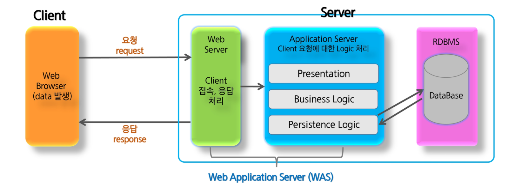

# Servlet & JSP

<br>

## Servlet

<br>

### 1. Web Architecture

<br>



> Web Server는 http 서버, 클라이언트의 접속, 응답을 처리  
> Application Server는 클라이언트 요청에 대한 로직을 처리(웹서버와 DB를 연결해주는것 등등)  
> 웹서버와 어플리케이션 서버를 합친걸 Web Application server , WAS라 함

<br>

##### WAS

웹서버와 데이터베이스를 연결해줄 Application Server가 필요

과거엔 http서버(웹서버)와 Application Server를 따로 불렀으나 최근엔 WAS(예-톰캣)로 함께 부름. java로 돌릴수있는 Application Server가 톰캣

결과적으로 WAS는 웹에서 java를 돌릴 수 있게 해줌!

<br>

##### Application Server

1. Presentation (화면에 보이기: html 이나 xml이나.. 일처리한 결과 markup language)
2. Business Logic (로직: 일처리.. business: DB를 제외한 일처리들)
3. Persistence Logic (persistence: DB로직)

완료된것을 클라이언트에게 응답(response) - 주로 html/xml/json

html은 화면을 만들어 넘겨주는거고 xml이나json은 사용여부?정도만 넘겨주는것

##### 요약

1. 클라이언트에서 데이터 발생
2. 서버에게 요청
3. 서버는 데이터를 받아 일처리를함
4. 클라이언트에게 응답

<br>

<br>

### 2. Project 생성

<br>

1. New >> Dynamic Web Project
2. project name 설정, target runtime 선택(톰캣9)
3. context root와 content directory 확인

> dynamic web module버전이 3.0미만일 경우 generate web xml~ 체크박스 선택필수. 일반적으로 annotation 사용하므로 체크안함  
> context root : /로 설정하게 되면 ~~.com으로 현 사이트로 이동 가능

src에 java파일, 나머지는 WebContent에(html, css, js, jsp, img....등)

자바를 웹에서 돌아가게 하기 위한 서블렛을 쓰기 위해선 java ee api 의 javax.servlet 필요. 클래스에서는 Servlet을 implements해야함

<br>

##### Servlet Class 종류

- extends Servlet :

1. destroy : 자원반환
2. init : 초기화
3. service : 요청, 응답(로직 해결 - 서비스만 주로 사용)

- extends GenericServlet : service만 구현하면 되나 Get과 Post를 if로 구분해야 함

- extends HttpServlet : doGet, doPost를 사용하며 추상메소드가 없음

HttpServlet을 사용

URL mapping : 주소 뒤에 붙는 부분 (http:/ ~~ / context root / url mapping)

<br>

##### 페이지 이동 방법

1. url 입력
2. link
3. form - get / post  
   (여기서 form의 post를 제외한 모든것은 get방식)

<br>

##### HTML 출력객체

```java
PrintWriter out = response.getWriter();
response.setContentType("text/html;charset=utf-8");
out.println("<html>");
out.println("  <body>");
out.println("    Hello");
out.println("  </body>");
out.println("</html>");
```

<br>

##### 절차

1. data를 얻음
2. 1.의 data를 이용해 로직 처리
3. 2.의 결과에 따른 response page

<br>

<br>

### 3. Servlet

자바 서블릿은 자바를 사용하여 웹페이지를 동적으로 생성하는 서버측 프로그램 혹은 그 사양을 말하며, 흔히 서블릿이라 불림

자바 서블릿은 웹서버의 성능을 향상하기 위해 사용되는 자바 클래스의 일종

서블릿은 JSP와 비슷한 점이 있지만, JSP가 HTML문서 안에 Java코드를 포함하고 있는 반면, 서블릿은 자바 코드 안에 HTML을 포함하고 있다는 차이점을 가짐
(Servlet의 불편함을 해결하기 위해 JSP )

<br>

##### Servlet Life-Cycle

Servlet class는 javaSE에서의 class와 다르게 main method가 없음

즉, 객체의 생성부터 사용(method call)의 주체가 사용자가 아닌 Servlet Container에게 있음

Client가 요청을 하게 되면 Servlet Container는 Servlet객체를 생성(한번만)하고, 초기화(한번만)하며 요청에 대한 처리(요청시마다 반복)를 함. 또한 Servlet객체가 필요없게 되면 제거하는 일까지 Container가 담당

<br>

##### Servlet cycle의 주요 method

| method    | description                                                                       |
| --------- | --------------------------------------------------------------------------------- |
| init()    | 서블릿이 메모리에 로드될 때 한번 호출. 코드 수정이로 인해 다시 로드되면 다시 호출 |
| doGet()   | GET방식으로 data전송시 호출                                                       |
| doPost()  | POST방식으로 data전송시 호출                                                      |
| service() | 모든 요청은 service()를 통해서 doXXX()메소드로 이동                               |
| destroy() | 서블릿이 메모리에서 해제되면 호출. 코드가 수정되면 호출                           |

destroy는 서버 끌때, service안의 doGet, doPost는 사람들이 들어올때마다, init이나 생성자는 서버가 시작할때 실행됨

만약 링크가 /프로젝트명/~~~/~.html이면, 프로젝트명까지는 WebContent로 들어온거고, 그다음 이 특정폴더, 그폴더안에 ~.html이 있는것

```java
$("#writeform").attr("action", "/servlet/write").submit();
// 여기서 write가 서블렛 annotation부분의 url
```

```java
@WebServlet("write")
public class Write extends HttpServlet{
   private DBUtil util = DBUtil.getInstance();

   protected void doPost(HttpServletRequest request, HttpServletResponse response) throws Exception{
      //1. data get
      request.setCharacterEncoding("utf-8"); //이는 post에서만. get에선 안함
      String str = request.getParameter("text");
      //2. 로직
      Connection conn = null;
      PreparedStatement pstmt = null;
      int cnt = 0;
      try {
         conn = util.getConnection();
         String sql = "insert into memo";
         sql += "values (?)";
         pstmt = conn.preparedStatement(sql);
         pstmt.setString(1, str);
         cnt = pstmt.executeUpdate();
      } catch(SQLException e){
         e.printStacTrace();
      } finally {
         util.close(pstsmt, conn);
      }
      //3. response page
      response.setContentType("text/html;charset=utf-8");
      PrintWriter out = response.getWriter();
      // html문 out에 넣으면됨
   }
}
```

<br>

##### 파라미터 전송방식 (GET vs POST)

|      | GET                                                                                                                | POST                                                                                  |
| ---- | ------------------------------------------------------------------------------------------------------------------ | ------------------------------------------------------------------------------------- |
| 특징 | 전송되는 데이터가 URL뒤에 QueryString으로 전달<br> 입력값이 적은 경우나 데이터가 노출이 돼도 문제가 없을 경우 사용 | URL과 별도로 전송<br>HTTP header뒤 body에 입력 스트림 데이터로 전달                   |
| 장점 | 간단한 데이터를 빠르게 전송<br> form tag뿐 아니라 직접 URL에 입력하여 전송 가능                                    | 데이터의 제한이 없음<br>최소한의 보안 유지 효과                                       |
| 단점 | 데이터 양에 제한이 있음<br> location bar(URL+parameters)를 통해 전송할 수 있는 데이터의 사이즈는 2kb로 제한        | 전달 데이터의 양이 같을 경우 GET보다 느림<br>(전송 패킷을 body에 데이터로 구성하기에) |

- URL & QueryString & Parameter


?뒤로 전부 QueryString

<br>

<br>

## JSP (Java Servlet Page)

<br>

### 1. JSP

JSP는 HTML내에 자바 코드를 삽입하여 웹 서버에서 동적으로 웹페이지를 생성하여 웹브라우저에 돌려주는 언어

Java EE 스펙 중 일부로 웹 어플리케이션 서버에서 동작

자바 서버 페이지는 실행시에는 자바 서블릿으로 변환된 후 실행되므로 서블릿과 거의 유사하나 서블릿과 달리 HTML표준에 따라 작성되므로 웹 디자인하기에 편리

이와 비슷한 구조로 PHP, ASP, ASP.NET등이 있음

아파치 스트럿츠나 자카르타 프로젝트의 JSTL등의 JSP 태그 라이브러리를 사용하는 경우에는 자바 코딩없이 태그만으로 간략히 기술이 가능하므로 생산성을 높일 수 있음

서블릿에서 PrintWriter out = response.getWriter(); 을 선언하고, out.println()에 다 집어넣기에는 너무 많을 수도 있고, "가 있는경우 \"로 바꿔줘야 하는등 많은 불편함이 따름

> 서블렛은 java안에 html을 넣는거고
> JSP는 html안에 java를 넣는거

<br>

### 2. JSP 동작 흐름

##### JSP최초 요청시

> 1. Servlet java file로 변환
> 2. Servlet class compile
> 3. Servlet class 를 메모리에 적재

JSP는 최초 요청시에만 servlet으로 변경됨. 그 이후에는 매핑된 서블릿이 실행

즉 JSP는 서블릿과 외형적(코딩)차이만 있음 (실행적으론 거의 차이 안남)

<br>

### 3. JSP 스크립팅 요소(Scripting Element)

1. 선언 (Declaration)

멤버변수 선언(전역변수) 이나 메소드를 선언하는 영역

```java
<%! 멤버변수와 method작성 %>

<%!
String name;
public void init(){
	name = "정지영";
}
%>
```

2. 스크립트릿 (Scriptlet)

처리문

Client요청시 매번 호출 영역으로, Servlet으로 변환시 service() method에 해당되는 영역

request, response에 관련된 코드 구현

```java
<% java code%>

<%
for(int i=1; i<10; i++){
	out.println("<tr>");
	String classname = i&2==0? "color2" : "color2";
	out.println("</tr>");
}
```

3. 표현식 (Expression)

출력문

데이터를 브라우저에 출력할 때 사용

```java
<%= 문자열 %>

안녕 <%= name %> !!

// 주의
<%= 문자열; %> : 문자열 뒤 세미콜론붙이면 안됨
<%= 문자열%> == <% out.print(문자열); %> : 같은표현
```

4. 주석 (Comment)

코드상에서 부가 설명을 작성

```java
<%-- 주석 할 code --%>

<!-- HTML주석 -->
<%-- JSP주석 -->
<% /* Java주석 */ %>

jsp문을 html 주석으로으로 처리할 수 없음
<!-- <%= name %> -->  //이 표현식는 주석처리 되지 않음
<%-- <%= name %> -->  //주석처리 됨
```

- 실행순서

자바가 html, css, script보다 먼저 실행됨!

그래서 \<script>태그 안에 <% %> 자바(jsp문)넣는거 불가능

<br>

### 4. JSP 지시자 (Directive)

<%@ %> : 지시문

1. page Directive

컨테이너에게 현재 JSP페이지를 어떻게 처리할 것인가에 대한 정보를 제공

```java
<%@ page attr1 = "val1" attr2 = "val2" ... %>
```

2. include Directive

특정 jsp 파일을 페이지에 포함

여러 jsp페이지에서 반복적으로 사용되는 부분을 jsp file로 만든 후 반복 영역에 include 시켜 반복되는 코드를 줄일 수 있다

```java
<%@ include file = "/template/header.jsp" %>
```

3. taglib Directive

JSTL또는 사용자에 의해 만든 커스텀태그를 아용할 때 사용되며

JSP페이지 내에 불필요한 자바 코드를 줄일 수 있다

```java
<%@ taglib prefix="c" url="http://java.sun.com/jsp/jstl/core" %>
```

모든 문자열은 ""안에 들어가야함

contentType을 항상 utf-8로 바꿔줘야 함

<br>

##### JSP 기본객체

| 기본객체명  | 설명                                                                                                                |
| ----------- | ------------------------------------------------------------------------------------------------------------------- |
| request     | HTML폼 요소의 선택 값 등 사용자 입력 정보를 읽어올 때 사용                                                          |
| response    | 사용자 요청에 대한 응답을 처리하기 위해 사용                                                                        |
| pageContext | 각종 기본 객체를 얻거나 forward및 include 기능을 활용할 때 사용                                                     |
| session     | 클라이언트에 대한 세션 정보를 처리하기 위해 사용                                                                    |
| application | 웹서버의 어플리케이션 처리와 관련된 정보를 레퍼런스 하기 위해 사용                                                  |
| out         | 사용자에게 전달하기 위한 output 스트림을 처리할 때 사용                                                             |
| config      | 현재 JSP에 대한 초기화 환경을 처리하기 위해 사용                                                                    |
| page        | 현재 JSP페이지에 대한 참조 변수                                                                                     |
| exception   | Error를 처리하는 JSP의 isErrorPage속성을 true로 설정하면 사용 가능. 기본은 false. 전달된 오류 정보를 담은 내장 객체 |

사용자가 만들지 않아도 기본적으로 만들어주기에 jsp문 안에서 변수 선언을 하지 않아도 이 객체들은 그대로 사용하면됨

기본객체 = 내장객체

page는 this정도로 생각하면 됨

<br>

##### JSP 기본객체의 영역(scope)

| 영역        | 설명                                                                                                                                                                                                                                    |
| ----------- | --------------------------------------------------------------------------------------------------------------------------------------------------------------------------------------------------------------------------------------- |
| pageContext | 하나의 JSP페이지를 처리할 때 사용되는 영역<br> 한번의 클라이언트 요청에 대해 하나의 JSP페이지가 호출되며 한개의 page객체만 대응됨<br>페이지 영역에 저장한 값은 페이지를 벗어나면 사라짐<br>커스텀 태그에서 새로운 변수를 추가할 때 사용 |
| request     | 하나의 HTTP요청을 처리할 때 사용되는 영역<br>웹브라우저가 요청할때마다 새로운 request객체가 생성됨<br>request영역에 저장한 속성은 그 요청에 대한 응답이 완료되면 사라짐                                                                 |
| session     | 하나의 웹브라우저와 관련된 영역<br>같은 웹브라우저 내에서 요청되는 페이지들은 같은 session을 공유<br>로그인 정보 등을 저장                                                                                                              |
| application | 하나의 웹어플리케이션과 관련된 영역<br>웹어플리케이션당 한개의 application객체 생성<br>같은 웹어플리케이션에서 요청되는 페이지들은 같은 application객체를 공유                                                                          |

##### 공통 method

servlet과 jsp페이지 간에 특정 정보를 주고 받거나 공유하기 위한 메소드를 지원

| method                                       | 설명                                                                           |
| -------------------------------------------- | ------------------------------------------------------------------------------ |
| void setAttribute(String name, Object value) | 문자열 name으로 Object형 데이터 저장                                           |
| Object getAttribute(String name)             | 문자열 name에 해당하는 속성 값이 있으면 Object형태로 가져오고 없으면 null 리턴 |
| Enumeration getAttributeNames()              | 현재 객체에 저장된 속성들의 이름들을 Enumeration 형태로 가져옴                 |
| void removeAttribute(String name)            | name에 해당하는 속성을 삭제                                                    |

범위 : page context < request < session < application

page context. setAttribute하면 해당 페이지(jsp)안에서만 사용가능하고

request.setAttribute 하면 해당 요청을 한 다른 페이지에서도 사용가능

session : 사용자인증

session.setAttribute 하면 인증된사람은 사용가능(디폴트로 session = true로 되어있음)

application.setAttribute 하면 제약없이 어디서든지

request 랑 session많이씀

<br>

##### WEB Page 이동

||forward(request, response)|sendRedirect(location)|
|사용법|RequestDispatcher dispatcher = <br> request.getRequestDispatcher(path);<br>dispatcher.forward(request,response);|response.sendRedirect(location);|
|이동범위|동일서버(project)내 경로|동일 서버 포함 타 URL|
|location bar|기존 URL유지|이동하는 page로 변경|
|객체|기존의 request, response 그대로 전달|기존의 request, response는 소멸되고 새로운 request와 response가 생성|
|속도|비교적빠름|forward()에 비해 느림|
|데이터유지|request의 setAttribute(name, value)로 전달|request로는 데이터 저장 불가능. session이나 cookie이용|

페이지 이동방법은 forward, sendRedirect로 두가지가 있음

forward : 전달 - 모든것들이 넘어감

sendRedirect : 현재페이지에서 location으로 되돌려보냄

sendRedirect의 location은 url(http~)이고, forward의 path는 경로(예-/todolist/list.jsp)

단, request는 어차피 프로젝트 안에서만 돌아가기 때문에 context-root는 붙이면 안됨

request는 메모리에 담겨있는거라서 현 프로젝트 밖으론 못나감

내 프로젝트 안에서만 쓰는jar 파일은 WEB-INF → lib 에 넣어놓으면 알아서 돌아간다함
