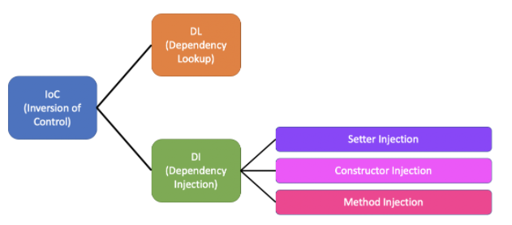

# IoC & Container

 

 

## 1. IoC (Inversion of Control, 제어의 역행)

(필요한대로 순차대로 만드는게 아니라 미리 만들어놓고 쓴다)

IoC/DI

객체지향 언어에서 Object간의 연결 관계를 런타임에 결정

객체 간의 관계가 느슨하게 연결됨 (loose coupling)

IoC 의 구현 방법 중 하나가 DI (Dependency Injection)

 

## 2. IoC 유형

IoC에는 Lookup과 Injection이 있음

Injection에서는 실질적으로 두가지만 사용 (Setter와 Constructor)

 

#### Dependency Lookup

> 컨테이너가 lookup context를 통해서 필요한 Resource나 Object를 얻는 방식
>
> JNDI 이외의 방법을 사용한다면 JNDI관련 코드를 오브젝트 내에서 일일이 변경해 주어야함
>
> Lookup한 Object를 필요한 타입으로 Casting 해주어야함
>
> Naming Exception을 처리하기 위한 로직이 필요

#### Dependency Injection

> Object에 lookup 코드를 사용하지 않고 컨테이너가 직접 의존 구조를 Object에 설정 할 수 있도록 지정해주는 방식
>
> Object가 컨테이너의 존재 여부를 알 필요가 없음
>
> Lookup 관련된 코드들이 Object내에서 사라짐
>
> Setter Injection과 Constructor Injection
>
> 즉, lookup 안쓰고 주입

 

## 3. Container

#### Container란

> 객체의 생성, 사용, 소멸에 해당하는 라이프사이클을 담당
>
> 라이프사이클을 기본으로 애플리케이션 사용에 필요한 주요 기능을 제공

 

#### Container 기능

> 라이프 사이클 관리
>
> Dependency 객체 제공
>
> Thread 관리
>
> 기타 애플리케이션 실행에 필요한 환경

 

#### Container 필요성

> 비즈니스 로직 외에 부가적인 기능들에 대해서는 독립적으로 관리되도록 하기 위함
>
> 서비스 look up이나 Configuration에 대한 일관성을 갖기 위함
>
> 서비스 객체를 사용하기위해 각각 Factory 또는 Singleton 패턴을 직접 구현하지 않아도 됨

 

#### IoC Container

> 오브젝트의 생성과 관계 설정, 사용, 제거 등의 작업을 애플리케이션 코드 대신 독립된 컨테이너가 담당
>
> 컨테이너가 코드 대신 오브젝트에 대한 제어권을 갖고 있어 IoC라고 부름
>
> 이런 이유로, 스프링 컨테이너를 IoC컨테이너라고 부르기도함
>
> 스프링에서 IoC를 담당하는 컨테이너에는 BeanFactory, ApplicationContext가 있음

 

#### Spring DI Container

> Spring DI Container가 관리하는 객체를 빈(Bean)이라 하고, 이 빈들의 생명주기를 관리하는 의미로 빈팩토리(BeanFactory)라 함
>
> BeanFactory에 여러가지 컨테이너 기능을 추가하여 Application Context라 함
>
> 일반적으로 BeanFactory 보다 그를 확장한 ApplicationContext를 사용

 

## 4. IoC 개념

 

#### 객체 제어 방식

`기존 : ` 필요한 위치에서 개발자가 필요한 객체 생성 로직 구현

`IoC : ` 객체 생성을 Container에게 위임하여 처리

 

#### IoC 사용에 따른 장점

객체 간의 결합도를 떨어뜨릴 수 있음 (loose coupling)

 

#### 객체간 결합도가 높으면?

해당 클래스가 유지보수 될 때 그 클래스와 결합된 다른 클래스도 같이 유지보수 되어야 할 가능성이 높음

 

#### 객체간 강한 결합

클래스 호출 방식

클래스 내에 선언과 구현이 모두 되어 있기 때문에 다양한 형태로 변화가 불가능

 

#### 결합도 낮추기

객체간의 강한 결합을 다형성을 통해 결합도를 낮춤

- 인터페이스 호출 방식

  - 구현 클래스 교체가 용이하여 다양한 형태로 변화 가능하나 인터페이스 교체 시 호출 클래스도 수정해야함

- Factory를 통한 방식

  - 팩토리 호출 방식

  - 팩토리 방식은 팩토리가 구현 클래스를 생성하므로 클래스는 팩토리를 호출

  - 인터페이스 변경 시 팩토리만 수정하면 됨. 호출 클래스에는 영향을 미치지 않음

  - 하지만 클래스 팩토리를 호출하는 소스가 들어가야 함. 그것 자체가 팩토리에 의존함을 의미

- Assembler를 통한 방식

  - IoC호출 방식

  - 팩토리 패턴의 장점을 더하여 어떠한 것에도 의존하지 않는 형태가 됨

  - 실행시점(Runtime)에 클래스간의 관계가 형성이 됨

 

즉, 자바가 아닌 외부 조립기를 둠으로써 결합도를 낮춤. 이 조립기를 스프링이 담당

스프링 컨테이너에 의해 생성된 객체를 빈이라고 표현

 

## 5. Spring DI 용어 정리

1. 빈 (Bean)

   스프링이 IoC방식으로 관리하는 오브젝트

   스프링이 직접 그 생성과 제어를 담당하는 오브젝트만을 Bean이라 함

2. 빈 팩토리 (Bean Factory)

   스프링이 IoC를 담당하는 핵심 컨테이너

   Bean 을 등록, 생성, 조회, 반환하는 기능을 담당

   일반적으로 BeanFactory를 바로 사용하지 않고 이를 확장한 ApplicationContext를 이용

3. 애플리케이션 컨텍스트 (Application Context)

   BeanFactory를 확장한 IoC컨테이너

   Bean을 등록하고 관리하는 기본적인 기능은 BeanFactory와 동일

   스프링이 제공하는 각종 부가 서비스를 추가로 제공

   BeanFactory라고 부를때는 주로 빈의 생성과 제어의 관점에서 이야기하는 것이고, 애플리케이션 컨텍스트라고 할 때는 스프링이 제공하는 애플리케이션 지원 기능을 모두 포함해서 이야기하는 것

   (웹환경에서는 이를 확장한 WebApplicationContext 사용)

4. 설정정보/설정 메타정보(configuration metadata)

   스프링의 설정정보란 ApplicationContext또는 BeanFactory가 IoC를 적용하기 위해 사용하는 메타정보를 말함

   이는 구성정보 내지는 형상정보라는 의미

   설정정보는 IoC컨테이너에 의해 관리되는 Bean 객체를 생성하고 구성할 때 사용됨

   XML또는 annotation으로 만듦

5. 스프링 프레임워크

   스프링 프레임워크는 IoC컨테이너, ApplicationContext를 포함해서 스프링이 제공하는 모든 기능을 통틀어 말할때 주로 사용됨
