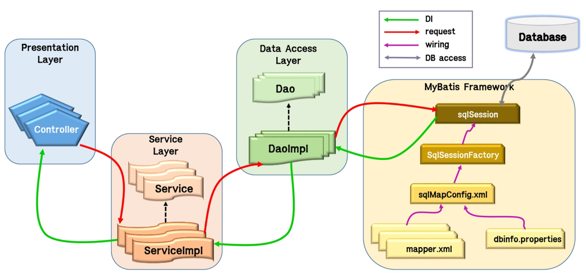
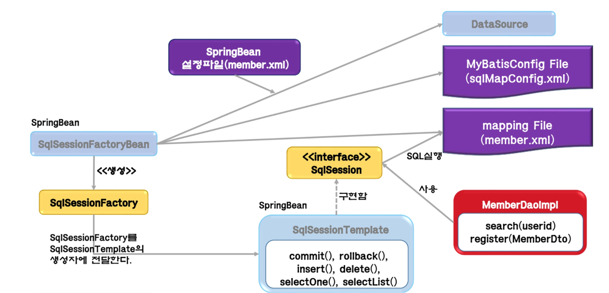

# MyBatis

 

 

MyBatis : JDBC를 대신해주는 프레임워크, Dao 와 연관이 있음

## 1. MyBatis

 

#### MyBatis 개요

MyBatis는 JavaObject 와 SQL문 사이의 `자동 Mapping`기능을 지원하는 ORM Framework

https://blog.mybatis.org

MyBatis는 SQL을 별도의 파일로 분리해서 관리

Object - SQL 사이의 parameter mpapping작업을 자동으로 해줌

MyBatis는 Hibernate나 JPA(Javapersistence API) 처럼 새로운 DB프로그래밍 패러다임을 익혀야하는 부담이 없이 ,개발자가 익숙한 SQL을 그대로 이용하면서 JDBC 코드 작성의 불편함을 제거해주고 도메인 객체나 VO객체를 중심으로 개발이 가능

 

#### MyBatis 특징

- 쉬운 접근성과 코드의 간결함

가장 간단한 persistence framework

XML 형태로 서술된 JDBC코드라 생각해도될 만큼 JDBC의 모든 기능을 Mybatis가 대부분 제공

복잡한 JDBC코드를 걷어내며 깔끔한 소스코드를 유지

수동적인 parameter설정과 Query결과에 대한 mapping구문을 제거

- SQL문과 프로그래밍 코드의 분리

SQL변경이 있을때마다 자바 코드를 수정하거나 컴파일하지 않아도됨

SQL작성과 관리 또는 검토를 위한 DBA와 같은 개발자가 아닌 다른사람에게 맡길 수 있음

다양한 프로그래밍 언어로 구현 가능

JAVA, C#, .NET, Ruby, ..

- MyBatis 기본설정 및 사용은 기술문서 참조

 

## 2. MyBatis와 MyBatis-Spring 의 주요 Component

- MyBatis와 MyBatis-Spring 을 사용한 DB Access Architecture

- MyBatis를 사용하는 Data Access Layer

- MyBatis 3의 주요 Component

- MyBatis 3의 주요 Component 의 역할

| 파일                                   | 설명                                                                                                                                        |
| -------------------------------------- | ------------------------------------------------------------------------------------------------------------------------------------------- |
| MyBatis 설정파일 (sqlMapConfig.xml) | 데이터베이스의 접속 주소 정보나 객체의 alias, Mapping파일의 경로 등의 고정된 환경 정보 설정                                                 |
| SqlSessionFactoryBuilder               | MyBatis 설정 파일을 바탕으로 SqlSessionFactory 생성                                                                                         |
| SqlSessionFactory                      | SqlSession 생성                                                                                                                             |
| SqlSession                             | 핵심적인 역할을 하는 class로 SQL실행이나 Transaction관리를 실행 SqlSession오브젝트는 Tread-Safe하지 않으므로 thread마다 필요에 따라 생성 |
| mapping 파일 (member.xml)           | SQL문과 ORMapping을 설정                                                                                                                    |

- MyBatis-Spring 의 주요 Component

- MyBatis-Spring 의 주요 Component 의 역할

| 파일                                   | 설명                                                                                                                                                   |
| -------------------------------------- | ------------------------------------------------------------------------------------------------------------------------------------------------------ |
| MyBatis 설정파일 (sqlMapConfig.xml) | Dto 객체의 정보를 설정(Alias)                                                                                                                          |
| SqlSessionFactoryBean                  | MyBatis 설정 파일을 바탕으로 SqlSessionFactory 생성  Spring Bean으로 등록해야 함                                                                    |
| SqlSessionTemplate                     | 핵심적인 역할을 하는 class로 SQL실행이나 Transaction관리를 실행 SqlSession interface를 구현해야 하며, Thread-safe함  Spring Bean으로 등록해야 함 |
| mapping 파일 (member.xml)           | SQL문과 ORMapping을 설정                                                                                                                               |
| Spring Bean 설정파일(beans.xml)        | SqlSessionFactoryBean 을 Bean에 등록할 때 DataSource정보와 MyBatisConfig파일정보, Mapping파일의 정보를 함께 설정 SqlSessionTemplate를 Bean으로 등록 |

 

## 3. MyBatis3의 Mapper Interface

 

#### Mapper Interface

Mapper Interface는 mapping 파일에 기재된 SQL을 호출하기 위한 Interface

Mapper Interface는 SQL을 호출하는 프로그램을 Type Safe 하게 기술하기 위해 MyBatis 3.x부터 등장

Mapping 파일에 있는 SQL을 java interface를 통해 호출할 수 있도록 해 줌

 

#### Mapper Interface를 사용하지 않았을 경우

SQL을 호출하는 프로그램은 SqlSession의 method의 argument에 문자열로 namespace + "." + SQL ID 로 지정

문자열로 지정하기 때문에 오타에 의한 버그가 생기거나, IDE에서 제공하는 code assist를 사용할 수 없음

 

#### Mapper Interface를 사용했을 경우

UserMapper Interface는 개발자가 작성

packagename + "." + InterfaceName + "." + methodName 이 namespace + "." + SQL ID 가 되도록 Namespace 와 SQL ID를 설정해야함

Namespace와 SQL ID를 설정해야함

Namespace와 속성에는 package 를 포함한 Mapper Interface의 이름을 작성

SQL ID에는 mapping하는 method의 이름을 지정

 

## 4. MyBatis 와 Spring의 연동

 

#### 개요

MyBatis 를 Standalone 형태로 사용하는 경우, SqlSessionFactory 객체를 직접 사용

스프링을 사용하는 경우, 스프링 컨테이너에 MyBatis 관련 빈을 등록하여 MyBatis를 사용

또한 스프링에서 제공하는 트랜잭션 기능을 사용하면 손쉽게 트랜잭션 처리

MyBatis 를 스프링과 연동하기 위해서는 MyBatis에서 제공하는 Spring 연동 라이브러리가 필요

 

#### DataSource 설정

스프링을 사용하는 경우, 스프링에서 데이터 소스를 관리하므로 MyBatis 설정파일에서는 일부 설정을 생략

스프링 환경 설정파일 (application-context.xml) 에 데이터소스를 설정

데이터소스는 dataSource 아이디를 가진 빈으로 데이터베이스 연결정보를 가진 객체

MyBatis 와 스프링을 연동하면 데이터베이스 설정과 트랜잭션 처리는 스프링에서 관리

 

#### 트랜잭션 관리자 설정

transaction Manager 아이디를 가진 빈은 트랜잭션을 관리하는 객체

MyBatis 는 JDBC를 그대로 사용하기 때문에 DataSourceTransactionManager 타입의 빈을 사용

tx:annotation-driven 요소는 트랜잭션 관리방법을 어노테이션으로 선언하도록 설정

스프링은 메소드나 클래스에 @Transactional 이 선언되어 있으면, AOP를 통해 트랜잭션을 처리

 

#### SqlSessionFactoryBean 설정

MyBatis 애플리케이션은 SqlSessionFactory를 중심으로 수행

스프링에서 sqlSessionFactory 객체를 생성하기 위해서는 SqlSessionFactoryBean을 빈으로 등록해야함

SqlSessionFactoryBean을 빈으로 등록할 때, 사용할 데이터 소스와 mybatis 설정파일 정보가 필요

 

#### mapper 빈 등록

Mapper 인터페이스를 사용하기 위해서 스캐너를 사용하여 자동으로 등록하거나, 직접 빈으로 등록

mapperScannerConfigurer을 설정하면, Mapper 인터페이스를 자동으로 검색하여 빈으로 등록

basePackage로 패키지를 설정하면 해당 패키지 하위의 모든 매퍼 인터페이스가 자동으로 등록

MapperFactoryBean 클래스는 매퍼 인터페이스를 직접 등록할때 사용

 

#### MyBatis Configuration 파일

스프링을 사용하면 DB접속정보 및 Mapper 관련 설정은 스프링 빈으로 등록하여 관리

따라서 MyBatis 환경설정 파일에는 스프링에서 관리하지 않는 일부 정보만 설정

예) typeAlias, typeHandler 등

 

#### 데이터 접근 객체 구현

데이터 접근 객체는 특정한 기술을 사용하여 데이터 저장소에 접근하는 방식을 구현한 객체

@Repository 은 데이터 접근 객체를 빈으로 등록하기 위해 사용하는 스프링에서 제공하는 어노테이션

@Autowired 어노테이션을 통해, 사용하려는 Mapper인터페이스를 데이터 접근 객체와 의존관계를 설정
