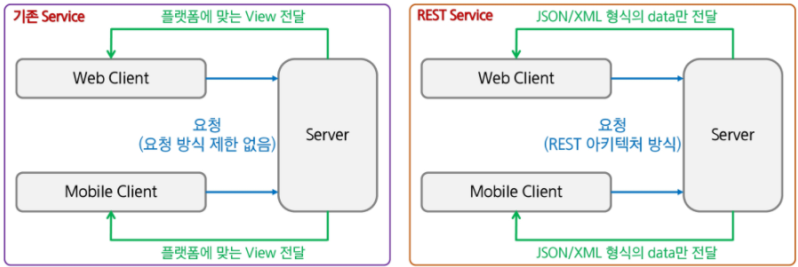

# Rest API

<br>

<br>

## 1. OPEN API (Application Programming Interface)

OPEN API 는 프로그래밍에서 사용할 수 있는 개방되어 있는 상태의 Interface

naver, kakao 등 포털 서비스 사이트나 통계청, 기상청, 우체국 등과 같은 관공서, 공공데이터 포털이 가지고 있는 데이터를 외부 응용프로그램에서 사용할 수 있도록 OPEN API 를 제공

OPEN API 와 함께 거론되는 기술이 REST 이며, 대부분의 OPEN API 는 REST 방식으로 지원

<br>

## 2. REST (Representational State Transfer)

'Representational State Transfer' 의 약어로 하나의 URI 는 하나의 고유한 리소스 (Resource)를 대표하도록 설계된다는 개념에 전송방식을 결합해서 원하는 작업을 지정

`URI + GET/POST/PUT/DELETE`

웹의 장점을 최대한 활용할 수 있는 아키텍처(설계구조) 로써 REST를 발표

HTTP URI를 통해 제어할 자원(Resource)를 명시하고, HTTP Method(GET, POST, PUT, DELETE) 을 통해 해당 자원을 제어하는 명령을 내리는 방식의 아키텍처

즉, URI을 통해 어떤 자원, 무슨행위, 어떤것을 표현할지를 녹여내는것

<br>

## 3. REST 구성

- 자원(Resource) - URI
- 행위(Verb) - HTTP Method
- 표현(Representations)

잘 표현된 HTTP URI로 리소스를 정의하고 HTTP method로 리소스에 대한 행위를 정의

리소스는 JSON, XML과 같은 여러가지 언어로 표현 가능

<br>

## 4. 기존 Service 와 REST Service

- 기존 Service : 요청에 대한 처리를 한 후 가공된 data를 이용하여 특정 플랫폼에 적합한 형태의 View로 만들어서 반환
- REST Service : data 처리만 한다 거나, 처리 후 반환될 data가 있다면 JSON이나 XML형식으로 전달. View에 대해서는 신경 쓸 필요가 없음 >> 이러한 이유로 Open API에서 많이 사용



<br>

## 5. REST

기존의 전송방식과는 달리 서버는 요청으로 받은 리소스에 대해 순수한 데이터를 전송

기존의 GET/POST 외에 PUT, DELETE 방식을 사용하여 리소스에 대한 CRUD 처리 가능

HTTP URI을 통해 제어할 자원(Resource) 을 명시하고 HTTP METHOD (GET/POST/PUT/DELETE) 를 통해 해당 자원(Resource)를 제어하는 명령을 내리는 방식의 Architecture

가장 큰 단점은 딱 정해진 표준이 없어 암묵적인 표준만 정해져 있다는 것

- 하이픈(-)은 사용 가능하지만 언더바(\_)는 사용하지 않음
- 특별한 경우를 제외하고 대문자 사용은 하지 않음(대소문자구분)
- URI마지막에 슬래시(/) 사용하지 않음
- 슬래시(/)로 계층관계 나타냄
- 확장자가 포함된 파일 이름을 직접 포함시키지 않음
- URI는 명사를 사용

<br>

#### 기존의 웹 접근 방식과 REST API 방식의 차이점

| 작업           | 기존방식                               | REST 방식               | 비고   |
| -------------- | -------------------------------------- | ----------------------- | ------ |
| Create(Insert) | POST /write.do?id=troment              | POST /blog/troment      | 글쓰기 |
| Read(Select)   | GET /view.do?id=troment&articleno=25   | GET /blog/troment/25    | 글읽기 |
| Update(Update) | POST /modify.do?id=troment             | PUT /blog/troment       | 글수정 |
| Delete(Delete) | GET /delete.do?id=troment&articleno=25 | DELETE /blog/troment/25 | 글삭제 |

기존의 블로그등은 GET과 POST만으로 자원에 대한 CRUD를 처리하며, URI는 액션을 나타냈음

REST로 변경할 경우 4가지 method를 모두 사용하여 CRUD를 처리하며, URI는 제어하려는 자원을 나타냄

<br>

## 6. REST API 설정

- Jackson library

jackson-databind 라이브러리는 객체를 JSON 포멧의 문자열로 변환시켜 브라우저로 전송

jackson-dataformat-xml 라이브러리는 객체를 xml 브라우저로 전송

pom.xml에 library 추가

<br>

## 7. REST 관련 Annotation

| Annotation      | Description                                           |
| --------------- | ----------------------------------------------------- |
| @RestController | Controller가 REST방식을 처리하기 위함을 명시          |
| @ResponseBody   | JSP 같은 뷰로 전달되는 것이 아니라 데이터 자체를 전달 |
| @PathVariable   | URL 경로에 있는 값을 파라미터로 추출                  |
| @CrossOrigin    | Ajax의 크로스 도메인 문제를 해결                      |
| @RequestBody    | JSON 데이터를 원하는 타입으로 바인딩                  |

- 일반적인 컨트롤러면 각 메소드마다 @ResponseBody를 붙여줘야하는데, 만약 모든 메소드가 뷰가 아니라 rest형식 이라면? 그 컨트롤러한테 @RestController 를 붙여주고 @ResponseBody 필요없음. 하지만 하나라도 ajax아니면 그냥 컨트롤러로 할것
- PathVariable 은 URL경로에 있는 /로 구분된 변수값을 추출
- CrossOrigin은 특정 도메인에서만 접근할수있도록
- RequestBody 은 Dto랑 JSON을 매핑시켜주기 위함

jackson data binding 이 ResponseBody로 설정되어있으면 넘어가는 데이터를 JSON으로 (Dto를 파라미터로 해서) 자동매핑시켜줌

똑같은 GET으로 보내는데, URL이 다르게하던가, 아니면 같은 URL을 보내는데 보내는걸 다르게하던가, 원하는 형식을 다르게

즉, RequestParam 은 변수로 넘어온거, PathVariable 은 경로상에 /user/{userid} 이런식으로 중괄호로 넘어온것

```jsx
@RequestMapping(value="/user/{userid}", method=RequestMethod.GET, header={"Content-type=application/json"})
public MemberDto userInfo(@PathVariable("userid") String userid) throws Exception{
	return memberService.getMember(userid);
}
//단, 여기서 reqeustmapping안의 이름과 pathvariable의 이름이 이름 같아야됨
```
